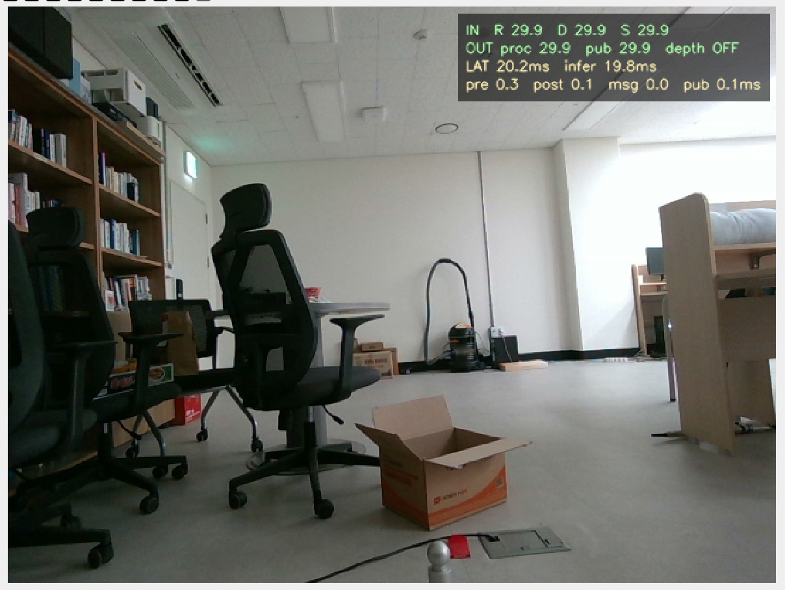

# KERI Robot Arm Vision Project

RealSense RGB-D 카메라와 YOLO Segmentation을 이용해 물체를 탐지하고, 깊이와 3차원 좌표를 계산해 ROS 2 메시지로 전달한 로봇팔 비전 과제의 소스 중심 아카이브입니다.

이 저장소는 약 22GB였던 DGX 작업 디렉터리에서 재실행에 필요한 코드, 설정, 최종 전달 모델, 대표 결과와 작은 RGB-D 샘플만 선별한 것입니다. 원본 데이터셋, 중간 모델, 동영상, 로그와 빌드 산출물은 포함하지 않습니다.



## 작업 흐름

```text
RealSense RGB-D 수집
  -> YOLO + SAM 자동 라벨 생성
  -> GUI 라벨 검수·수정
  -> 배경·조명·위치 증강
  -> YOLO Segmentation 학습·평가
  -> RGB-D 실시간 탐지와 depth refinement
  -> ROS 2 DetectionArray publish
```

## 디렉터리

| 경로 | 내용 |
| --- | --- |
| `data_annotation/pipeline/` | 초기 YOLO bbox + SAM segmentation 파이프라인과 GUI 편집기 |
| `data_annotation/tools/` | RealSense 수집, 라벨 생성·검수, 증강, bad-case 분석 도구 |
| `realtime_detection/` | 단독 RealSense 추론과 ROS 실행 스크립트 |
| `ros/workspace/src/` | 최종 ROS 2 탐지 패키지와 사용자 메시지 |
| `docker/` | 초기 YOLO GPU 벤치마크 Docker 환경 |
| `models/deployment/` | Git LFS로 보존한 최종 ROS 전달 모델 한 개 |
| `sample_data/` | 코드 확인용 RGB·depth·YOLO-seg label 한 세트 |
| `results/` | 선별한 학습 곡선, 혼동행렬, 예측 비교와 bad-case CSV |
| `docs/` | 재현 환경, 실험, 모델, 원본 이력과 제외 항목 |

## 빠른 시작

Python 환경은 프로젝트에 맞는 CUDA/PyTorch 조합을 먼저 설치한 뒤 구성합니다.

```bash
python3 -m venv .venv
source .venv/bin/activate
pip install -r requirements.txt
```

최종 ROS 전달 모델은 Git LFS 파일 `models/deployment/best.pt`로 포함됩니다. clone 후 `git lfs pull`로 내려받고 명령에 전달합니다.

```bash
git lfs pull
python realtime_detection/yolo_realtime_dgx_headless.py \
  --model models/deployment/best.pt
```

동봉한 RGB-D 샘플을 depth image 데이터셋으로 변환하려면 다음과 같이 실행합니다.

```bash
python ros/workspace/src/detection_bridge/tools/prepare_depth_yolo_dataset.py \
  --source sample_data/rgbd \
  --output data/generated_depth_yolo \
  --overwrite
```

라벨 형식 검사는 모델 없이 실행할 수 있습니다.

```bash
python data_annotation/tools/annotation/check_labels.py sample_data/rgbd/labels
```

ROS 빌드·실행법은 [`ros/README.md`](ros/README.md), 데이터 제작 절차는 [`data_annotation/README.md`](data_annotation/README.md)를 참고합니다.

## 저장소에 없는 자료

- 전체 학습·검증 데이터와 RGB-D 원본 촬영본
- 최종 전달 모델을 제외한 `.pt`, `.pth` 가중치
- 전체 학습 run과 예측 이미지
- 시연 동영상
- ROS/Python 로그, 캐시, 가상환경 및 빌드 결과
- Intel RealSense SDK checkout

모델 식별값은 [`docs/MODEL_MANIFEST.md`](docs/MODEL_MANIFEST.md), 제외 범위와 복원 방법은 [`docs/ARCHIVE_SCOPE.md`](docs/ARCHIVE_SCOPE.md)에 남겼습니다.

## 공개 전 주의

이 저장소는 공개되어 있으므로 소스와 최종 전달 모델도 공개됩니다. 참여자 동의, 모델 공개 가능 여부와 ROS 패키지의 `TODO` 라이선스 항목을 확인해야 합니다.
